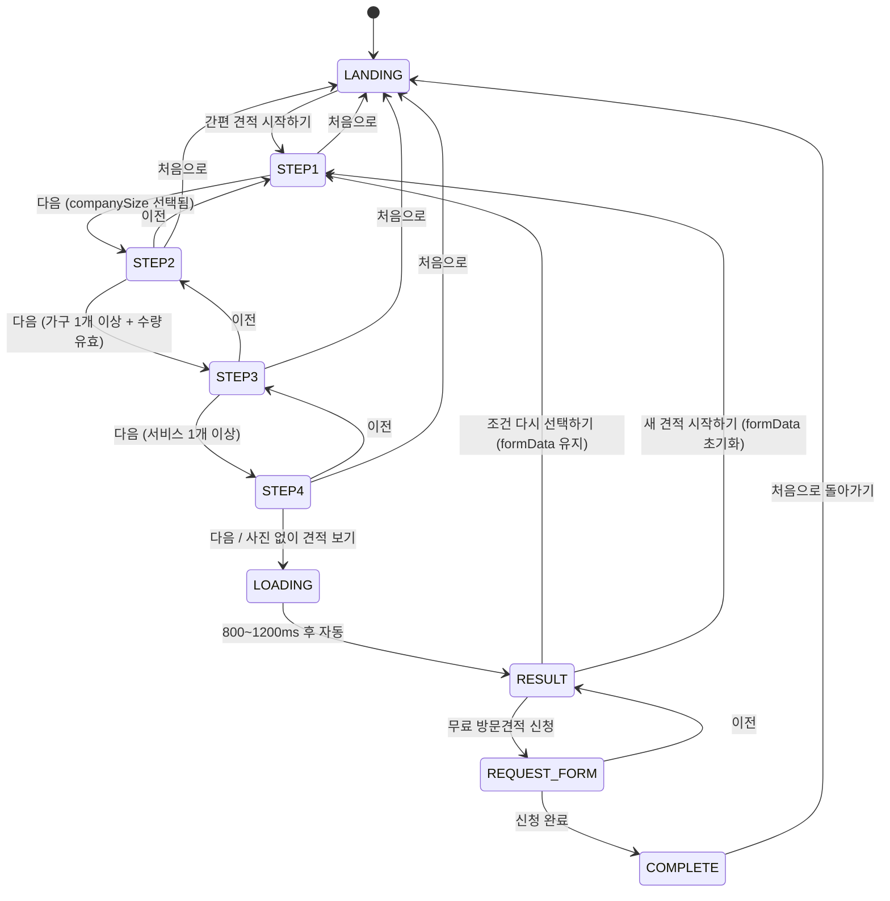
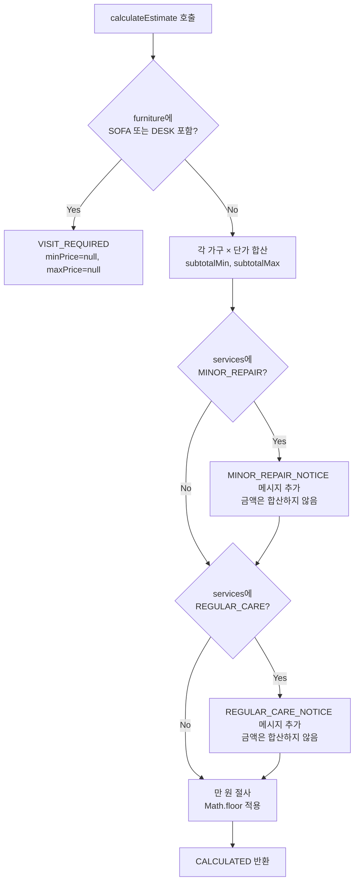

# Design Document: WOODFARM CARE 간편 견적 MVP

## Overview

WOODFARM CARE 간편 견적 MVP는 사무·상업 공간 담당자가 가구 관리 서비스(세척, 상태점검, 간단수리, 정기관리)의 예상 견적을 4단계 질문 흐름으로 확인하고 무료 방문견적을 신청할 수 있는 순수 프론트엔드 React + TypeScript + Vite 웹 애플리케이션이다.

이 MVP는 **조건 선택 → 예상 견적 확인 → 방문견적 신청**이라는 사업 흐름을 시연하는 것이 목적이며, 백엔드·데이터베이스·외부 API 연동은 포함하지 않는다. 모든 상태는 브라우저 메모리에서 관리되며 새로고침 시 초기화된다.

화면 상태(Screen State) 흐름:

```
LANDING → STEP1 → STEP2 → STEP3 → STEP4 → LOADING → RESULT → REQUEST_FORM → COMPLETE
                 ↑___________________________|  (조건 다시 선택하기 / 이전 버튼)
```

---

## Architecture

### 전체 구조

단일 페이지 SPA로 구현한다. 라우팅 라이브러리 없이 최상위 `AppShell` 컴포넌트가 `currentScreen` 상태값에 따라 적절한 화면 컴포넌트를 조건부 렌더링한다.

```
AppShell (useReducer — AppState)
├── LandingScreen
├── EstimateFlow (STEP1 ~ STEP4 + LOADING)
│   ├── StepNavigator
│   ├── Step1_SizeSelector
│   ├── Step2_FurnitureSelector
│   ├── Step3_ServiceSelector
│   ├── Step4_PhotoUploader
│   └── LoadingScreen
├── ResultScreen
├── RequestFormScreen
└── CompleteScreen
```

### 상태 소유 원칙

- 전역 앱 상태(`EstimateFormData`, `EstimateResult`, `currentScreen`)는 `AppShell`의 `useReducer`가 소유한다.
- 각 Step 내부의 임시 UI 상태(포커스, 호버 등)는 해당 컴포넌트의 `useState`가 소유한다.
- Step 간 이동 시 `dispatch` 액션으로 상위 상태를 업데이트한다.

### 데이터 흐름

```
AppShell (dispatch + state)
    │ props down
    ▼
EstimateFlow
    │ props down (formData, onUpdate, onNext, onBack)
    ▼
Step 컴포넌트들
    │ callback up (onUpdate: partial EstimateFormData)
    ▲
AppShell receives and merges into state
```

외부 라이브러리(Redux, Zustand 등)는 사용하지 않는다. Context API도 이 규모에서는 불필요하므로 props drilling으로 충분히 처리한다.

---

## Components and Interfaces

### AppShell

최상위 컴포넌트. `useReducer`로 전체 앱 상태를 관리하고 `currentScreen`에 따라 화면을 렌더링한다.

```typescript
// 화면 상태 열거형
type ScreenState =
  | 'LANDING'
  | 'STEP1'
  | 'STEP2'
  | 'STEP3'
  | 'STEP4'
  | 'LOADING'
  | 'RESULT'
  | 'REQUEST_FORM'
  | 'COMPLETE';

interface AppState {
  currentScreen: ScreenState;
  formData: EstimateFormData;
  result: EstimateResult | null;
}

type AppAction =
  | { type: 'START_ESTIMATE' }
  | { type: 'UPDATE_FORM'; payload: Partial<EstimateFormData> }
  | { type: 'GO_TO_STEP'; step: 1 | 2 | 3 | 4 }
  | { type: 'SUBMIT_STEP'; step: 1 | 2 | 3 | 4 }
  | { type: 'GO_BACK' }
  | { type: 'SHOW_LOADING' }
  | { type: 'SHOW_RESULT'; result: EstimateResult }
  | { type: 'GO_TO_REQUEST_FORM' }
  | { type: 'SUBMIT_REQUEST'; visitRequest: VisitRequest }
  | { type: 'RESET_ALL' }
  | { type: 'RESET_AND_RETRY' };
```

### StepNavigator

STEP1~4 화면 상단에 표시되는 진행 표시 컴포넌트.

```typescript
interface StepNavigatorProps {
  currentStep: 1 | 2 | 3 | 4;
  canProceed: boolean;
  onNext: () => void;
  onBack?: () => void; // STEP1에서는 undefined
  onReset: () => void;
}
```

- 진행 바: `width: ${currentStep * 25}%`
- `다음` 버튼: `canProceed`가 false이면 `disabled` 속성 부여 및 포인터 이벤트 차단
- `이전` 버튼: STEP2~4에서만 렌더링
- `처음으로` 버튼: 모든 STEP에서 표시, 클릭 시 `RESET_ALL` dispatch

### Step1_SizeSelector

```typescript
interface SizeSelectorProps {
  selected: CompanySize | null;
  onChange: (value: CompanySize) => void;
}
```

4개 카드(단일 선택). 선택된 카드에는 `data-selected="true"` 속성과 체크 아이콘을 표시한다. `canProceed = selected !== null`.

### Step2_FurnitureSelector

```typescript
interface FurnitureSelectorProps {
  items: FurnitureItem[];
  onChange: (items: FurnitureItem[]) => void;
}
```

4개 카드(복수 선택). 각 카드를 클릭하면 선택 토글. 선택된 카드 안에 스테퍼(- / 직접입력 / +)가 노출된다. 수량 유효성 검사는 이 컴포넌트 내부의 `useState`로 오류 상태를 관리하고, 상위로는 유효한 값만 올려보낸다.

```
canProceed = items.length > 0 && items.every(i => i.quantity >= 1 && i.quantity <= 999 && Number.isInteger(i.quantity))
```

### Step3_ServiceSelector

```typescript
interface ServiceSelectorProps {
  selected: ServiceType[];
  onChange: (services: ServiceType[]) => void;
}
```

4개 카드(복수 선택). `canProceed = selected.length > 0`.

### Step4_PhotoUploader

```typescript
interface PhotoUploaderProps {
  photos: UploadedPhoto[];
  onChange: (photos: UploadedPhoto[]) => void;
}
```

파일 선택 → 유효성 검사 → Object URL 생성 → 미리보기 렌더링. 삭제 시 `URL.revokeObjectURL` 호출. `canProceed`는 항상 true(0장이면 `사진 없이 견적 보기` 버튼, 1장 이상이면 `다음` 버튼으로 분기).

### ResultScreen

```typescript
interface ResultScreenProps {
  formData: EstimateFormData;
  result: EstimateResult;
  onRequestVisit: () => void;
  onRetry: () => void;
  onReset: () => void;
}
```

### RequestFormScreen

```typescript
interface RequestFormScreenProps {
  formData: EstimateFormData;
  result: EstimateResult;
  onSubmit: (req: VisitRequest) => void;
  onBack: () => void;
}
```

내부 `useState`로 폼 필드와 오류 상태를 관리한다. 유효성 검사는 제출 시점(submit) 및 blur 이벤트에서 실행한다.

### LoadingScreen

800~1200ms 랜덤 딜레이 후 자동으로 `SHOW_RESULT` 액션을 dispatch한다. `useEffect` 내부에서 `setTimeout` 사용.

---

## Data Models

```typescript
// ── 공통 열거 타입 ──────────────────────────────────────────

type CompanySize =
  | 'UNDER_10'
  | 'BETWEEN_11_30'
  | 'BETWEEN_31_50'
  | 'OVER_50';

type FurnitureType = 'CHAIR' | 'PARTITION' | 'SOFA' | 'DESK';

type ServiceType =
  | 'CLEANING'
  | 'INSPECTION'
  | 'MINOR_REPAIR'
  | 'REGULAR_CARE';

// ── 핵심 데이터 구조 ──────────────────────────────────────────

interface FurnitureItem {
  type: FurnitureType;
  quantity: number; // 1~999 정수
}

interface UploadedPhoto {
  file: File;
  previewUrl: string; // Object URL (URL.createObjectURL)
  name: string;       // 파일명 (alt 텍스트용, 최대 50자)
}

interface EstimateFormData {
  companySize: CompanySize | null;
  furniture: FurnitureItem[];
  services: ServiceType[];
  photos: UploadedPhoto[];
}

// ── 견적 결과 ─────────────────────────────────────────────────

type EstimateStatus = 'CALCULATED' | 'VISIT_REQUIRED';

interface EstimateResult {
  status: EstimateStatus;
  minPrice: number | null;  // 만 원 절사 후 값 (VISIT_REQUIRED이면 null)
  maxPrice: number | null;
  messages: EstimateMessage[];
}

type EstimateMessageType = 'MINOR_REPAIR_NOTICE' | 'REGULAR_CARE_NOTICE';

interface EstimateMessage {
  type: EstimateMessageType;
  text: string;
}

// ── 견적 설정 객체 ────────────────────────────────────────────

interface FurniturePriceConfig {
  min: number | null; // null = 방문 확인 필요
  max: number | null;
}

type EstimateConfig = Record<FurnitureType, FurniturePriceConfig>;

// 실제 값 (단 하나의 설정 객체에서 관리)
const estimateConfig: EstimateConfig = {
  CHAIR:     { min: 7000, max: 8500 },
  PARTITION: { min: 4000, max: 6500 },
  SOFA:      { min: null, max: null },
  DESK:      { min: null, max: null },
};

// ── 방문견적 신청 ─────────────────────────────────────────────

interface VisitRequest {
  // 폼 입력값
  managerName: string;
  companyName: string;
  phone: string;           // 숫자와 하이픈만 허용
  spaceType: SpaceType;
  region: string;
  inquiry: string;         // 선택 항목
  privacyConsent: boolean; // 필수

  // 견적 데이터 (자동 포함)
  formData: EstimateFormData;
  result: EstimateResult;
  submittedAt: string;     // ISO 8601 문자열
}

type SpaceType =
  | 'OFFICE'
  | 'CAFE'
  | 'RESTAURANT'
  | 'HOSPITAL'
  | 'ACADEMY'
  | 'OTHER';
```

### 초기 상태

```typescript
const INITIAL_FORM_DATA: EstimateFormData = {
  companySize: null,
  furniture: [],
  services: [],
  photos: [],
};

const INITIAL_APP_STATE: AppState = {
  currentScreen: 'LANDING',
  formData: INITIAL_FORM_DATA,
  result: null,
};
```

---

## Correctness Properties

*A property is a characteristic or behavior that should hold true across all valid executions of a system — essentially, a formal statement about what the system should do. Properties serve as the bridge between human-readable specifications and machine-verifiable correctness guarantees.*

### Property 1: 견적 계산 결과의 단가 범위 준수

*For any* 유효한 가구 목록(CHAIR·PARTITION만 포함, 각 수량은 1~999 정수)에 대해 `calculateEstimate`를 호출하면, 반환된 `minPrice`는 `∑(quantity × min단가)`를 만 원 단위로 절사한 값과 같고, `maxPrice`는 `∑(quantity × max단가)`를 만 원 단위로 절사한 값과 같아야 한다.

**Validates: Requirements 8.2, 8.3**

---

### Property 2: null 단가 가구 포함 시 VISIT_REQUIRED 반환

*For any* `furniture` 배열에 `SOFA` 또는 `DESK`가 하나라도 포함된 입력에 대해, `calculateEstimate`의 결과 `status`는 반드시 `'VISIT_REQUIRED'`이고 `minPrice`와 `maxPrice`는 `null`이어야 한다. 나머지 가구 조합이나 서비스 선택에 관계없이 이 조건은 항상 성립해야 한다.

**Validates: Requirements 8.5**

---

### Property 3: 견적 금액 만 원 절사 후 대소 관계 보존

*For any* `minRaw ≤ maxRaw`인 두 원시 금액에 대해, `Math.floor(v / 10000) * 10000` 절사를 적용한 뒤에도 `minPrice ≤ maxPrice` 관계는 반드시 유지되어야 한다.

**Validates: Requirements 8.3**

---

### Property 4: 크기 선택 단일 선택 불변성

*For any* 4개의 CompanySize 카드 중 하나를 클릭하면, 클릭된 카드만 선택 상태(강조 테두리, 배경색 변경, 체크 아이콘 모두 포함)가 되고 나머지 3개는 선택 해제 상태여야 하며, 동시에 `다음` 버튼이 활성화 상태가 되어야 한다.

**Validates: Requirements 3.2, 3.3, 3.5**

---

### Property 5: 가구 카드 토글 라운드트립

*For any* 가구 카드를 선택한 뒤 동일 카드를 다시 클릭하면, 해당 가구 항목이 목록에서 제거되고 수량 입력 영역이 숨겨져야 하며 선택 이전과 동일한 상태로 돌아와야 한다.

**Validates: Requirements 4.2, 4.3**

---

### Property 6: 가구 수량 유효성 — [1, 999] 정수 제약

*For any* 수량 입력값에 대해, 1 이상 999 이하의 정수만 유효한 수량으로 저장되어야 한다. 0, 1000 이상, 소수, 음수, 빈 문자열을 포함한 그 외 모든 값은 오류 상태를 유발해야 하며, 오류 상태에서는 `다음` 버튼이 비활성화 상태를 유지해야 한다.

**Validates: Requirements 4.4, 4.8**

---

### Property 7: 사진 업로드 총 수량 5장 상한 불변성

*For any* 현재 사진 n장(0 ≤ n ≤ 5)에서 m장을 추가하려 할 때, 결과 `UploadedPhoto[]` 배열의 길이는 항상 5 이하여야 하며, n + m > 5인 경우 초과된 파일 각각에 대해 `COUNT_EXCEEDED` 오류 메시지가 표시되어야 한다.

**Validates: Requirements 6.3, 6.6**

---

### Property 8: 유효한 이미지 파일의 미리보기 메타데이터 보존

*For any* JPEG·PNG·WEBP 형식이고 10MB 이하인 유효한 이미지 파일이 선택될 때, 생성된 `UploadedPhoto.previewUrl`은 빈 문자열이 아니어야 하고, `UploadedPhoto.name`은 원본 파일명에서 최대 50자로 잘린 문자열과 같아야 한다.

**Validates: Requirements 6.4, 14.5**

---

### Property 9: 공백 전용 문자열 이름 필드 거부

*For any* 공백 문자(스페이스, 탭, 줄바꿈, 유니코드 공백 포함)만으로 구성된 문자열이 담당자명 또는 업체명 필드에 입력되면, `s.trim() === ''`인 모든 문자열에 대해 해당 필드는 유효하지 않은 상태여야 하고 신청 버튼은 비활성화 상태를 유지해야 한다.

**Validates: Requirements 11.3, 11.5**

---

### Property 10: 연락처 필드 — 숫자·하이픈 외 문자 거부

*For any* 숫자(`0-9`)와 하이픈(`-`) 이외의 문자를 하나라도 포함하는 문자열이 연락처 필드에 입력되면, 해당 필드는 유효하지 않은 상태여야 하고 오류 메시지가 표시되어야 한다.

**Validates: Requirements 11.4, 11.5**

---

## Error Handling

### 파일 업로드 오류

유효성 검사는 파일 선택 이벤트 핸들러(`onChange`)에서 즉시 수행한다. 오류가 있는 파일은 목록에 추가하지 않고, 오류 메시지는 파일명과 함께 컴포넌트 로컬 상태(`useState<UploadError[]>`)에 저장하여 렌더링한다. 다음 파일 선택 시 이전 오류 목록은 초기화한다.

```typescript
interface UploadError {
  fileName: string;
  reason: 'INVALID_TYPE' | 'SIZE_EXCEEDED' | 'COUNT_EXCEEDED';
}
```

오류 메시지 예시:
- `INVALID_TYPE`: `"image.pdf" — JPG, PNG, WEBP 형식의 파일만 첨부할 수 있습니다.`
- `SIZE_EXCEEDED`: `"photo.png" — 파일 크기가 10MB를 초과하여 첨부할 수 없습니다.`
- `COUNT_EXCEEDED`: `"extra.jpg" — 사진은 최대 5장까지 첨부할 수 있습니다.`

### 폼 입력 오류

`RequestFormScreen`은 blur 이벤트마다 해당 필드를 검사하고, 제출 버튼 클릭 시 모든 필드를 일괄 검사한다. 오류가 있는 필드에는 `aria-invalid="true"`와 `aria-describedby`로 오류 메시지 요소를 연결한다.

```typescript
type FormErrors = Partial<Record<keyof VisitRequestFormFields, string>>;
```

### 메모리 누수 방지

`Photo_Uploader`가 언마운트되거나 사진이 삭제될 때 반드시 `URL.revokeObjectURL(photo.previewUrl)`을 호출한다. `useEffect` cleanup 함수에서 남아 있는 모든 Object URL을 해제한다.

```typescript
useEffect(() => {
  return () => {
    photos.forEach(p => URL.revokeObjectURL(p.previewUrl));
  };
}, []);
```

### 예외 없는 견적 계산

`calculateEstimate`는 순수 함수로 구현되며 예외를 던지지 않는다. 단가가 `null`인 가구가 포함되면 early return으로 `VISIT_REQUIRED` 결과를 반환한다. 빈 배열, 빈 서비스 목록 등 경계 케이스에서도 항상 유효한 `EstimateResult`를 반환한다.

---

## Testing Strategy

### 이중 테스트 접근

이 MVP는 순수 함수 로직(`calculateEstimate`, 유효성 검사 함수, 포맷 함수)과 UI 상호작용으로 명확히 분리된다. 두 레이어 모두 테스트하되 역할을 구분한다.

- **단위 테스트**: 구체적인 예시와 경계값, 에러 조건을 검증한다.
- **프로퍼티 기반 테스트**: 범용 불변 조건을 다양한 입력에 걸쳐 검증한다.

### 프로퍼티 기반 테스트 (Vitest + fast-check)

```
프레임워크: fast-check (https://fast-check.io)
실행 횟수: 최소 100 iterations per property
태그 형식: // Feature: woodfarm-care-mvp, Property {n}: {property_text}
```

각 설계 문서의 Correctness Property에 대해 단일 프로퍼티 테스트를 작성한다:

| 테스트 파일 | 검증 대상 Property |
|---|---|
| `calculateEstimate.property.test.ts` | Property 1, 2, 3 |
| `sizeSelector.property.test.ts` | Property 4 |
| `furnitureSelector.property.test.ts` | Property 5, 6 |
| `photoUploader.property.test.ts` | Property 7, 8 |
| `validation.property.test.ts` | Property 9, 10 |

**Property 1 테스트 예시:**
```typescript
// Feature: woodfarm-care-mvp, Property 1: 견적 계산 결과의 단가 범위 준수
it('의자·파티션 임의 수량에 대해 minPrice/maxPrice가 단가 기반 계산과 일치한다', () => {
  fc.assert(
    fc.property(
      fc.array(
        fc.record({
          type: fc.constantFrom('CHAIR' as const, 'PARTITION' as const),
          quantity: fc.integer({ min: 1, max: 999 }),
        }),
        { minLength: 1, maxLength: 8 }
      ),
      (items) => {
        const uniqueItems = deduplicateByType(items);
        const result = calculateEstimate({
          companySize: 'BETWEEN_11_30',
          furniture: uniqueItems,
          services: ['CLEANING'],
          photos: [],
        });
        if (result.status !== 'CALCULATED') return false;
        const expectedMin = Math.floor(
          uniqueItems.reduce((s, i) => s + i.quantity * estimateConfig[i.type].min!, 0) / 10000
        ) * 10000;
        const expectedMax = Math.floor(
          uniqueItems.reduce((s, i) => s + i.quantity * estimateConfig[i.type].max!, 0) / 10000
        ) * 10000;
        return result.minPrice === expectedMin && result.maxPrice === expectedMax;
      }
    ),
    { numRuns: 100 }
  );
});
```

**Property 2 테스트 예시:**
```typescript
// Feature: woodfarm-care-mvp, Property 2: null 단가 가구 포함 시 VISIT_REQUIRED 반환
it('SOFA 또는 DESK가 포함된 임의 입력에 대해 항상 VISIT_REQUIRED를 반환한다', () => {
  fc.assert(
    fc.property(
      fc.array(
        fc.record({
          type: fc.constantFrom('CHAIR' as const, 'PARTITION' as const, 'SOFA' as const, 'DESK' as const),
          quantity: fc.integer({ min: 1, max: 999 }),
        }),
        { minLength: 1, maxLength: 8 }
      ).filter(items => items.some(i => i.type === 'SOFA' || i.type === 'DESK')),
      fc.array(fc.constantFrom('CLEANING' as const, 'INSPECTION' as const, 'MINOR_REPAIR' as const, 'REGULAR_CARE' as const), { minLength: 1 }),
      (items, services) => {
        const result = calculateEstimate({ companySize: 'BETWEEN_11_30', furniture: items, services, photos: [] });
        return result.status === 'VISIT_REQUIRED' && result.minPrice === null && result.maxPrice === null;
      }
    ),
    { numRuns: 100 }
  );
});
```

**Property 9 테스트 예시:**
```typescript
// Feature: woodfarm-care-mvp, Property 9: 공백 전용 문자열 이름 필드 거부
it('공백만으로 구성된 문자열은 이름 필드에서 항상 유효하지 않다', () => {
  fc.assert(
    fc.property(
      fc.stringOf(fc.constantFrom(' ', '\t', '\n', '\r', '\u3000'), { minLength: 1, maxLength: 50 }),
      (whitespaceStr) => {
        expect(validateName(whitespaceStr)).toBe(false);
      }
    ),
    { numRuns: 100 }
  );
});
```

### 단위 테스트 (Vitest)

기준 견적 확인 테스트(Requirements 8.8):

```typescript
it('의자 30개 + 파티션 10개 + 세척 + 상태점검 → 약 25~32만 원', () => {
  const result = calculateEstimate({
    companySize: 'BETWEEN_11_30',
    furniture: [
      { type: 'CHAIR', quantity: 30 },
      { type: 'PARTITION', quantity: 10 },
    ],
    services: ['CLEANING', 'INSPECTION'],
    photos: [],
  });
  expect(result.status).toBe('CALCULATED');
  expect(result.minPrice).toBe(250000); // (30×7000 + 10×4000) = 250,000
  expect(result.maxPrice).toBe(320000); // (30×8500 + 10×6500) = 320,000
});
```

추가 단위 테스트 범위:
- 소파/책상 포함 시 `VISIT_REQUIRED` 반환
- `MINOR_REPAIR` / `REGULAR_CARE` 선택 시 메시지 포함, 금액 미합산
- 만 원 미만 절사 정확성
- 연락처 유효성 검사(숫자·하이픈 이외 문자 거부)
- 공백 전용 문자열 입력 거부
- 파일 타입/크기/수량 초과 오류 분류

### UI 통합 테스트

`@testing-library/react`로 사용자 흐름 핵심 경로를 테스트한다:
- STEP1 → STEP2 이동 시 입력값 유지
- 선택 없이 `다음` 버튼 비활성화
- 5장 초과 파일 선택 시 오류 표시

---

## File Structure

```
src/
├── care/                          # WOODFARM CARE 간편 견적 — 독립 섹션
│   ├── index.tsx                  # 섹션 진입점 (AppShell)
│   │
│   ├── config/
│   │   └── estimateConfig.ts      # 단가 설정 객체 (단일 소스)
│   │
│   ├── types/
│   │   └── index.ts               # 모든 타입 정의 (EstimateFormData 등)
│   │
│   ├── lib/
│   │   ├── calculateEstimate.ts   # 순수 견적 계산 함수
│   │   ├── validatePhone.ts       # 연락처 유효성 검사
│   │   ├── validateName.ts        # 이름/업체명 유효성 검사
│   │   ├── validatePhoto.ts       # 파일 유효성 검사
│   │   └── formatPrice.ts         # 견적 금액 포맷팅 (만 원 절사·표시)
│   │
│   ├── hooks/
│   │   └── useAppReducer.ts       # AppState useReducer + 액션 정의
│   │
│   ├── screens/
│   │   ├── LandingScreen.tsx
│   │   ├── EstimateFlow.tsx       # STEP1~4 + StepNavigator 컨테이너
│   │   ├── LoadingScreen.tsx
│   │   ├── ResultScreen.tsx
│   │   ├── RequestFormScreen.tsx
│   │   └── CompleteScreen.tsx
│   │
│   ├── components/
│   │   ├── StepNavigator.tsx
│   │   ├── Step1_SizeSelector.tsx
│   │   ├── Step2_FurnitureSelector.tsx
│   │   ├── Step3_ServiceSelector.tsx
│   │   └── Step4_PhotoUploader.tsx
│   │
│   └── styles/
│       └── care.css               # 섹션 범위 스타일
│
└── (기존 woodfarmgagu 파일들)
```

### 핵심 모듈 상세

**`config/estimateConfig.ts`**
```typescript
export const estimateConfig: EstimateConfig = {
  CHAIR:     { min: 7000,  max: 8500  },
  PARTITION: { min: 4000,  max: 6500  },
  SOFA:      { min: null,  max: null  },
  DESK:      { min: null,  max: null  },
};
```

**`lib/calculateEstimate.ts`** — 핵심 로직 요약
```
1. furniture 배열에 SOFA 또는 DESK가 있으면 → VISIT_REQUIRED 반환
2. 각 가구: subtotalMin += quantity × config[type].min
            subtotalMax += quantity × config[type].max
3. MINOR_REPAIR가 services에 있으면 → 금액 미포함, MINOR_REPAIR_NOTICE 메시지 추가
4. REGULAR_CARE가 services에 있으면 → 금액 미포함, REGULAR_CARE_NOTICE 메시지 추가
5. minPrice = Math.floor(subtotalMin / 10000) * 10000
   maxPrice = Math.floor(subtotalMax / 10000) * 10000
6. CALCULATED 결과 반환
```

**`lib/formatPrice.ts`**
```typescript
// 250000 → "약 25만 원", 250000~320000 → "약 25~32만 원"
export function formatPriceRange(min: number, max: number): string {
  const minMan = min / 10000;
  const maxMan = max / 10000;
  return minMan === maxMan
    ? `약 ${minMan}만 원`
    : `약 ${minMan}~${maxMan}만 원`;
}
```

**`hooks/useAppReducer.ts`** — reducer 전환표

| 현재 화면 | 액션 | 다음 화면 |
|---|---|---|
| LANDING | START_ESTIMATE | STEP1 |
| STEP1 | SUBMIT_STEP(1) | STEP2 |
| STEP2 | SUBMIT_STEP(2) | STEP3 |
| STEP3 | SUBMIT_STEP(3) | STEP4 |
| STEP4 | SUBMIT_STEP(4) | LOADING |
| LOADING | SHOW_RESULT | RESULT |
| RESULT | GO_TO_REQUEST_FORM | REQUEST_FORM |
| RESULT | RESET_AND_RETRY | STEP1 (formData 유지) |
| RESULT | RESET_ALL | STEP1 (formData 초기화) |
| REQUEST_FORM | SUBMIT_REQUEST | COMPLETE |
| COMPLETE | RESET_ALL | LANDING |
| 모든 STEP | GO_BACK | 이전 STEP |
| 모든 STEP | RESET_ALL | LANDING |

---

## Mermaid Diagrams

### 화면 전환 다이어그램



### 견적 계산 로직 흐름


